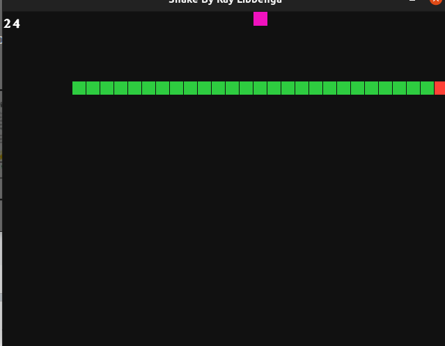

# Snake Game By Ray Libbenga (AKA aeternus(007)) #
- [Preview](#preview)
- [Installation](#installation)
- [Running The Game](#running-the-game)
- [Controls](#controls)
- [Project Description And Explanation](#project-description-and-explanation)
---

## Preview ##
[back to the start](#snake-game-by-ray-libbenga)



## Installation ##
[back to the start](#snake-game-by-ray-libbenga)

To run this game you have to install Ruby and the ruby2d gem.
You can [download Ruby](https://www.ruby-lang.org/en/downloads/) here and you can find installing instructions [here](https://www.ruby2d.com/learn/get-started/)

## Running The Game ##
[back to the start](#snake-game-by-ray-libbenga)

To run the game you have to be in the folder where snake.rb is. then run in the command ```ruby snake.rb```

## Controls ##
[back to the start](#snake-game-by-ray-libbenga)

Wasd ans arrow keys to control the snake.
Space to pause the game.
Enter (return) for starting over when you see the game-over screen.

## Project Description And Explanation ##
[back to the start](#snake-game-by-ray-libbenga)

So I made this snake game, because I wanted to learn a new language (Ruby) and I wanted to dig deeper into game development. The reason why i chose to program Snake was because a friend responded with "Snake" when I asked what I should program. First I reacted quite sceptic, because I only knew Ruby for 2 days by then, altho I was intriged by this idea. So there i was, three days later, with a fully finished Snake game ✨. Now I finished it I'll explain the code!!

### Setting Up The Game ###
- [back to the start](#snake-game-by-ray-libbenga)
- [Window](#window)
- [Constants](#constants)
- [The Snake](#the-snake)
- [The Apple](#the-apple)
- [Restart The Game](#restart-the-game)
- [Key Presses](#key-presses)
- [Updating](#updating)
---
First of all we need to use the gem called ruby2d. this gem gives us a way to use the screen for a _GUI-based_ game.
```ruby
require 'ruby2d'
```

#### Window ####
[back to "Setting Up The Game"](#setting-up-the-game)

Ok lets now set up the window. 

```ruby
set title: "Snake By Ray Libbenga"
set background: "black"
set fps_cap: 10
```
What we just did was setting the window title to "Snake By Ray Libbenga", making the backgroung black, and set the fps to 10.

#### Constants ####
[back to "Setting Up The Game"](#setting-up-the-game)

Now it's time for constants, because they make our lifes wayyy easier.

```ruby
APPLE = "fuchsia"
HEAD = "red"
BODY = "green"

WIDTH = 640
HEIGHT = 480

GRID = 20

BOUND_X = WIDTH / GRID
BOUND_Y = HEIGHT / GRID
```
As you probably alread guessed, te color-constants are used for the colors the head and body of the snake, and for the apple. The WIDTH and HEIGHT represent the screen sizes. Based on those values we have a grid with cells with a size of 20 pixels. BOUND_X and BOUND_Y gives us the size of the screen, mesured in cells.

#### The Snake ####
[back to "Setting Up The Game"](#setting-up-the-game)

After the first basic setup we finally can look at the fun part, the classes!! First we will look at the Snake Class.

```ruby
class Snake

    attr_reader(:head)
    attr_accessor(:alive, :direction, :score)

    def initialize(grid_size)
        @size = grid_size -1
        @direction = "left"
        @alive = true
        @snake = [[22, 20], [21, 20], [20, 20]]
        @head = @snake[-1]
        @score = 0
    end

    def draw
        @snake.each_with_index do |part, i|
            if i == @snake.length() - 1
                Square.new(x: part[0] * GRID, y: part[1] * GRID, size: @size, color: HEAD)
            else
                Square.new(x: part[0] * GRID, y: part[1] * GRID, size: @size, color: BODY)
            end
        end
    end

    def update(apple_eaten)
        if @alive
            if not apple_eaten
                @snake.shift()
            end

            x, y = @snake[-1]

            case @direction
            when "up"
                new_segment = [x, (y - 1) % BOUND_Y]
            when "right"
                new_segment = [(x + 1) % BOUND_X, y]
            when "down"
                new_segment = [x, (y + 1) % BOUND_Y]
            when "left"
                new_segment = [(x- 1) % BOUND_X , y]
            end
            
            @snake << new_segment
            @head = @snake[-1]

            if @snake[0..@snake.size - 2].include?(@head)
                @alive = false
            end
        end
    end
end
```
Yay, we just made the Snake class ✨. First we make a property reader and some property accessors. After that we have the initialize the snake, where we put some neseccary data for the snake to work. When you scroll down you will see a draw method. When this is called, it will draw all the parts in the snake list on the grid. the update method below the draw method checks the snakes direction, and whether an apple is eaten or not, and it also looks for collisions between the head and the body of the snake.

#### The Apple ####
[back to "Setting Up The Game"](#setting-up-the-game)

That was it for the Snake, now lets take a look at the Apple class, because without an apple, the game makes absolutely no sence at all!
```ruby
class Apple
    
    attr_reader(:position)

    def initialize(color)
        @color = color
        @position = [rand(0...BOUND_X), rand(0...BOUND_Y)]
    end

    def draw
        Square.new(x: position[0] * GRID, y: position[1] * GRID, size: GRID, color: @color)
    end
end
```
If we take a look at the Apple class we see only one property reader, and one method besides the initialize method. This method, the draw method, only places the apple on the screen.

#### Restart The Game ####
[back to "Setting Up The Game"](#setting-up-the-game)

To make the restarting easier after dying, I made a setup function.
```ruby
def setup(grid, color)
    return Snake.new(grid), Apple.new(color)
end
```
The only thing this function does is making a new snake and a new apple at the start of a game "session", and return them.

#### Key Presses ####
[back to "Setting Up The Game"](#setting-up-the-game)

After all this code, its time to finally handle some key presses!

```ruby
on :key_down do |event|
    case event.key
    when "down", "s"
        unless player.direction == "up"
            player.direction = "down"
        end
    when "up", "w"
        unless player.direction == "down"
            player.direction = "up"
        end
    when "left", "a"
        unless player.direction == "right"
            player.direction = "left"
        end
    when "right", "d"
        unless player.direction == "left"
            player.direction = "right"
        end
    end

    if player.alive and event.key == "space"
        paused = !paused
    end
    if player.alive == false and event.key == "return"
        player, apple = setup(GRID, APPLE)
    end
end
```
This fancy piece of code handles user input 😎. when the user presses one of the wasd or arrow keys, the snake will change direction, as long as the new direction isn't the opposite of the snakes current direction. It also lets the player pause and restart the game using the spacebar. And, at the end (hehe literally the end, for the snake at least) the player can press enter to restart the game (and hé that setup function is pretty damn usefull isn't it?).

#### Updating ####
[back to "Setting Up The Game"](#setting-up-the-game)

Although it is really fun to get some user input, its useless when u don't update the screen. so lezgo do some updating!!

```ruby
update do 
    clear()

    if player.alive() and paused
        Text.new("Paused", x: 250, y: 200, style: "bold", size: 40, color: "white")
   
    elsif player.alive() and not paused
        if apple.position == player.head
            player.score += 1
            apple_eaten = true
            apple = Apple.new(APPLE)
        else
            apple_eaten = false
        end

        apple.draw()
        player.update(apple_eaten)
        player.draw()

        Text.new("#{player.score}", x: 0, y: 0, style: "bold", size: 20, color: "white")
 
    else
        Text.new("Game Over", x: 220, y: 170, style: "bold", size: 40, color: "red")
        Text.new("(Press Enter To Start Again)", x: 185, y: 230, style: "bold", size: 20, color: "red")
    end
end
```
The update code clears the screen, and checks if the player is alive. When the player is and the game isn't paused, the snake will be able to move and eat apples. It also draws the current score. When the player is alive, but the game is paused, all actions to update the snake are skipped, and the text "Pause" will be displayed on the screen. if the game has been "unpaused", the updating of the snake will recontinue. and at the very last moment (when the snake is dead) there will be a game-over screen, with instructions on how to restart the game with a new snake. (YAY setup function ✨)

__and that was it for the code!!__

- [back to "Setting Up The Game"](#setting-up-the-game)
- [back to the start](#snake-game-by-ray-libbenga)
